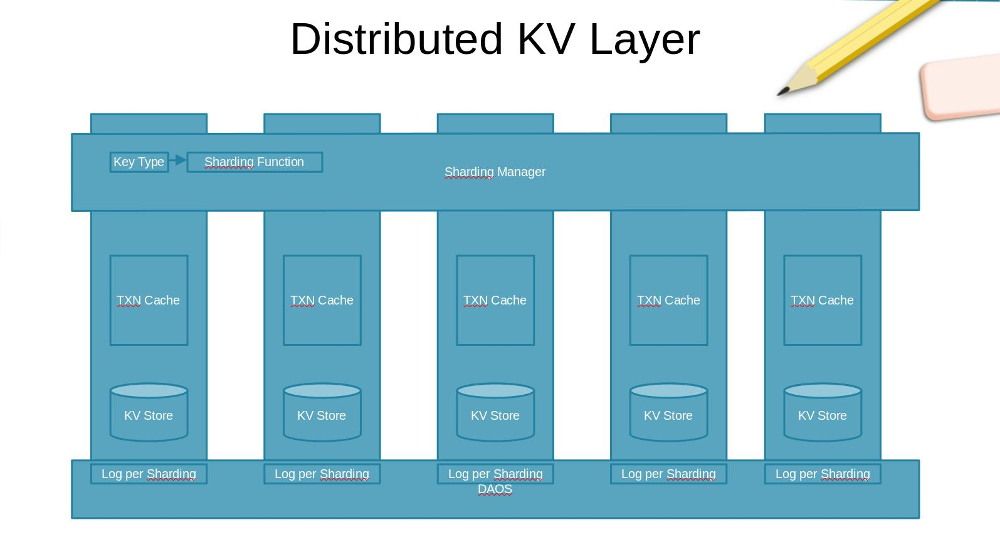

# Distributed KV Layer

## Architecture

### Basis

The distributed KV layer is built on the DAOS object layer. It supports distributed transactions for KV operations. The transaction relies on two phase commit and HLC. This layer is designed to provide better write/read? performance than the raw DAOS KV system.

### Main Components

The distributed KV layer consists of these parts.

1.  Sharding Manager
2.  Epoch Manager
3.  Individual KV Stores
4.  Transaction Manager
    1.  Intent Log
    2.  Transaction Leader/Follower Designation
    3.  Transaction Cache
5.  Snapshot Manager
    1.  Snapshotting
6.  Supported Interfaces
    1.  Point Query
    2.  Range Search (comfined to one store)
    3.  Snapshoting
    4.  Transactions

### Sharding Manager

1.  Manage sharding ids mapping information.
2.  Manage the change of sharding id mapping when nodes fail or join in.
3.  Allow sharding through customized functions, or selecting from a predefined family of functions.
4.  Provide the interface for looking up the destination node for a key.

### Epoch Manager

1.  Manage the generation of Epoches. It may be related to RPC. We may reuse the HLC from DAOS.
2.  Associate KV data change with Epoches.
3.  Substitue KV Store versions for Epoches.

### Individual KV Stores

1.  Use an existing KV stores.
2.  The KV store must support fine granular versioning.

### Transaction Manager

1.  Client choose one related node as Transaction Leader.
2.  Transaction Leader write to Intent Log and notify other followers.
3.  Transaction Followers write their Log and respond to the leader.
4.  After recieving all responds Transaction Leader change state to committing, after this this transaction is committed in effect, and notify all followers to commit.
5.  Transaction Leader will mark transactiona as committed.
6.  Deal with many exception cases, timeout, failure, reboot, etc.
7.  After followers respond to the leader they should told conflicting reads to refer to the leader, and conflicting writes to wait.

### Snapshot Manager

1.  A snapshot is equal to all nodes read operation. The maximum Epoch collected from all nodes is used as the timestamp for the snapshot.
2.  Manage the snapshot information, Epoch, filesystem, etc.

