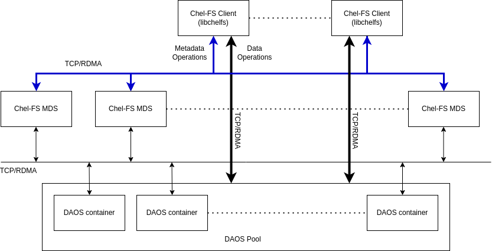

## Table of Contents

- [Chel-FS](#chel-fs)
- [Design Principles](#design-principles)
  - [Disaggregated Distributed File System Service](#disaggregated-distributed-file-system-service)
  - [Chel-FS Metadata Service (MDS)](#chel-fs-metadata-service-mds)
    - [Sharded Compute Responsibility](#sharded-compute-responsibility)
      - [Adding and removing MDSs](#adding-and-removing-mdss)
    - [Delegate Locks and Capabilities](#delegate-locks-and-capabilities)
    - [FS layout on DAOS containers](#fs-layout-on-daos-containers)
    - [Distributed Transaction Synchronization](#distributed-transaction-synchronization)
  - [Chel-FS Client](#chel-fs-client)
  - [DAOS and Chel-FS entity relationship](#daos-and-chel-fs-entity-relationship)
  - [Chel-FS Snapshots](#chel-fs-snapshots)
  - [Chel-FS Quotas](#chel-fs-quotas)
  - [Chel-Helm](#chel-helm)
- [Chel-FS Internal Components](#chel-fs-internal-components)
- [Metadata Entities in Chel-fs and their Structures(Proto)](#metadata-entities-in-chel-fs-and-their-structuresproto)
- [HLD for File Operation](#hld-for-file-operation)

# Chel-FS

Chel File System(Chel-FS), is a disaggregated software defined distributed file system (POSIX compliant), built on top of DAOS (https://github.com/daos-stack/daos). The main objective of Chel-FS is to provide scalable file system metadata management at the same time, keep the stock performance/scale of DAOS for file data operations. Chel-FS is aimed for workloads that require high performance and scalable file system operations.



# Design Principles

## Disaggregated Distributed File System Service
The main objective of Chel-FS is to provide a disaggregated Distributed File System Service over DAOS Containers/Pool.
DAOS is capable to handle high volumes of Parallel Data Operations. But for high volumes of small file metadata operations
there is a need that this compute responsibility is distributed among disjoint file system metadata compute entities. We call these file system metadata compute entities as Chel-FS MDS.

## Chel-FS Metadata Service (MDS)  
As defined above, Chel-FS MDS (referred as MDS in the future) is responsible for following,
### Sharded Compute Responsibility

Chel-FS metadata is sharded amongst all the MDSs of the Cluster. The sharding of metadata entities is done on some properties of the sharded metadata entity

The sharding scheme is dictated on the following factors,
1. Optimal Layout of Chel-FS metadata on DAOS Objects. 
2. Disjoint Metadata Operations between MDSs (most of the times) i,e 1 Metadata operation would most of the time involve 1 MDS.
   1. Limited number of network hops for a Metadata operation
   2. Limited OR None distributed transaction/s (involving multiple MDSs) for a metadata operation.
3. Ease of Predictive Caching (Read-ahead caching) on a MDS
4. Ease of rebuild/reload during a failover or failback of MDS.
5. Ease of adding or removing MDSs with minimal distributed synchronizations between MDSs.
(TODO : Details in LLD of MDS Sharding)

For example: In case of Inode being the sharded metadata entity,
it is most likely to shard inodes using the inode's primary parent inode. (Note: A inode can have multiple parents due to multiple hardlinks, though this is exception for directories, as directories will have only 1 parent inode). The driving factor to this scheme of sharding is to keep Inodes of all the dentries belonging to a directory in the same shard, so that most frequent operations like readdir() or readdir_plus() (ls) won't have to hop around too many MDSs and the owning MDS can do a read ahead caching for a reentrant metadata operation like readdir. This also helps in maintaining a consistent view of the changing directory without have to have too many coordination or synchronization rpc calls amongst multiple MDS.


Chel-FS cluster could have multiple file systems and all the metadata of these filesystems would be sharded on N number of MDS of the cluster.
#### Adding and removing MDSs
The User/Admin should be able to add or remove MDSs depending on performance or cost needs.
Since storage/DAOS is ubiquitous (i.e accessed by all the MDS without having any storage affinity),
The number of MDS in a cluster can be increased or decreased seamlessly, depending on compute requirements of the workload or cost.
### Delegate Locks and Capabilities
Chel-FS MDS would be hosting Chel-FS client locks/delegation on metadata entities (like Inode) of the filesystems, so that clients can now cache the metadata entities (again like inodes) and could use these cached entities during Data IO operation of read and writes, without consulting the MDSs for every Data IO operation. Whenever there is a change in the status-quo of the entity the Chel-FS client would be notified to take appropriate actions (either give up the locks/delegation or update the cached metadata entity)

Chel-FS MDS would also host client capabilities what is permissions on a Chel-FS client level to do operations of read,write,delete etc. This way Chel-FS Clients can restricted or permitted to enable certain feature or IO operation.
### FS layout on DAOS containers
Chel-FS would maps a user filesystem to a DAOS container for the following reasons,
1. DAOS Containers (Extracts from https://docs.daos.io/v2.6/overview/storage/)
   1. "A container represents an object address space inside a DAOS pool"
      This means all the objects of a Chel-FS filesystem can be tucked in a container, like a unique namespace.
   2. Each container has it's own attributes and capabilities & once opened an application "may share this handle with any or all of its peers" processes
      This means all the MDSs which are serving a Chel-FS filesystem will be sharing a handle with all it's capabilities and authorizations.
   3. "Objects in a container may have different schemas for data distribution and redundancy over targets"
      This means a Chel-FS filesystems can map it's metadata object to a different distribution and redundancy scheme than the data objects.
      Metadata Object can use 3 way replica and Data Object can use Erasure Coding.
   4. "A DAOS object can be accessed through different APIs
        Multi-level key-array, Key-value and Array API"
      This means Chel-FS entities like Directory and Files can be easily mapped to one of these Object Types.
      (inspiration from https://github.com/daos-stack/daos/blob/master/src/client/dfs/README.md)
   5. "A container is the basic unit of transaction and versioning" & "The DAOS transaction API allows to combine multiple object updates into a single atomic transaction"
      This means MDSs can use this transaction API for multiple entities atomic updates
      Also a container snapshot would be mapped to a Chel-FS snapshot.(more about this [later](#chel-fs-snapshots))

### Distributed Transaction Synchronization
DAOS container does provide transaction which involves 1 or many Objects (which can be any of the filesystem entities).
As mentioned in https://docs.daos.io/v2.6/overview/transaction/#distributed-transactions
```
"Unlike POSIX, the DAOS API does not impose any worst-case concurrency control mechanism to address conflicting I/O operations. Instead, individual I/O operations are tagged with a different epoch and applied in epoch order, regardless of execution order. This baseline model delivers the maximum scalability and performance to data models and applications that do not generate conflicting I/O workload."
```
This is incredible but for MDS Transaction (metadata operation which could involve multiple entities) would required a level of isolation when the transactions happen. MDS Sharding model makes sure that no 2 MDS would work on same entities for most of the metadata operations. But some metadata operations require some level of coordination between 2 MDS eg: Rename/Move of file/Directories between 2 Parent directories. In this case 1 MDS would signal the other MDS that it would do the transaction on behalf of both, i.e unlink on 1st Parent and link on the 2nd Parent.

The MDS should have a Distributed Transaction Synchronization mechanism.
## Chel-FS Client

## DAOS and Chel-FS entity relationship  

## Chel-FS Snapshots
Chel-FS would provide snapshot feature at a filesystem level (Create and rollback).

Since a Chel-FS filesystem is mapped to a DAOS container, it would inherit this from the DAOS container.
DAOS containers can be snapshot-ed (https://github.com/daos-stack/daos/blob/master/docs/overview/transaction.md#container-snapshot)
"DAOS snapshots are very lightweight and are tagged with the epoch associated with the time when the snapshot was created. Once successfully created, a snapshot remains readable until it is explicitly destroyed. The content of a container can be rolled back to a particular snapshot."
This means using DAOS container snapshots we can snapshot Chel-FS filesystem what is associated with that DAOS Container.
(https://github.com/daos-stack/daos/blob/master/src/include/daos_cont.h)


Whats missing now in DAOS Container Snapshot
1. Snap-diff - This has to be implemented in DAOS and then consumed by Chel-FS.
2. Snapshot presentation in DFS Containers - Chel-FS has to implement this.
3. Writable snapshots or clones - (Aspirational)

## Chel-FS Quotas

## Chel-Helm

# Chel-FS Internal Components

# Metadata Entities in Chel-fs and their Structures(Proto)

# HLD for File Operation

